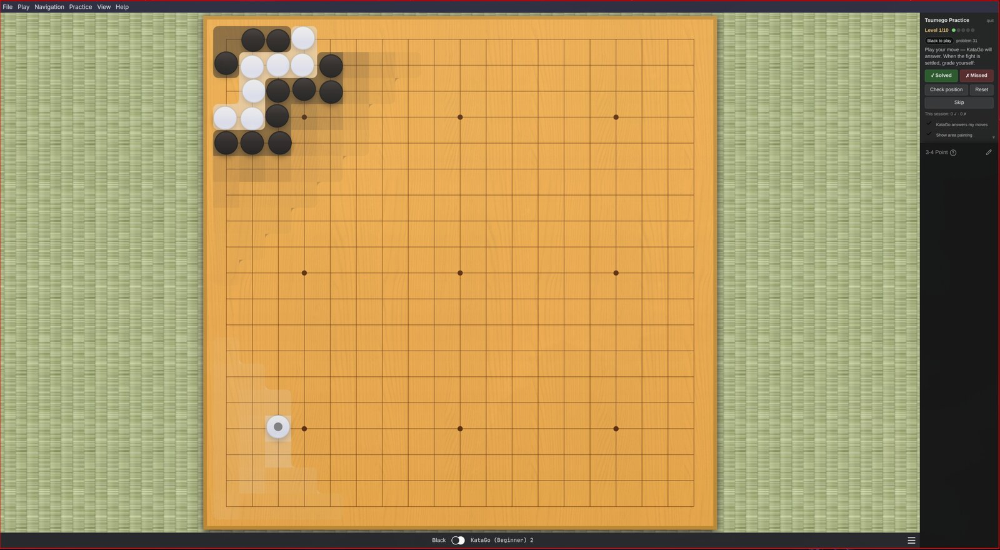
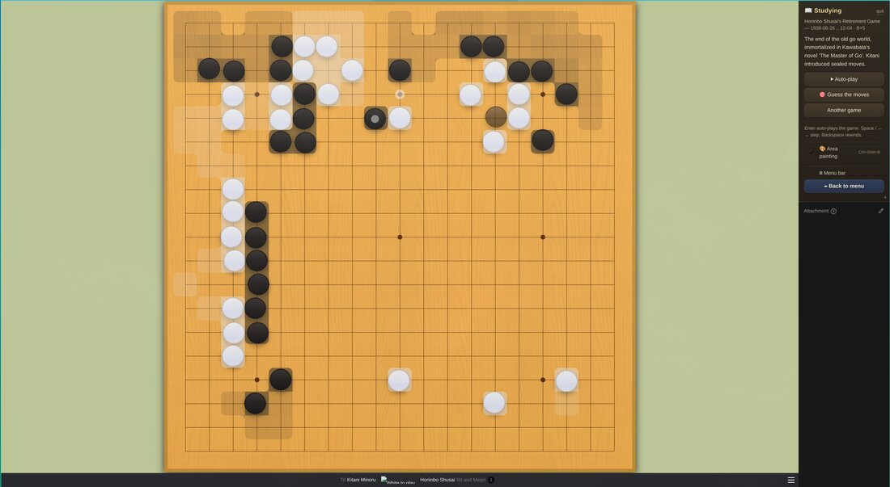
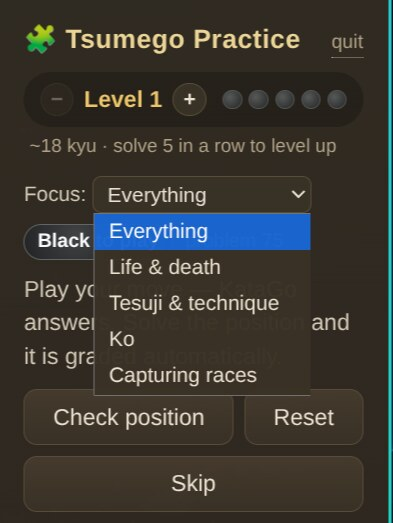
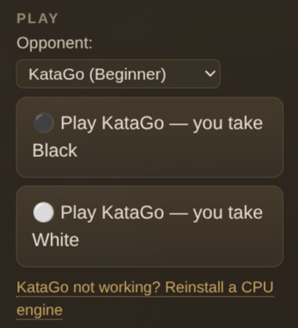
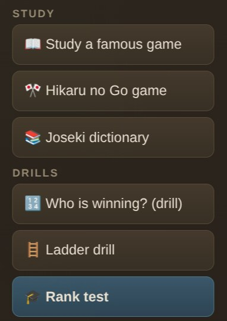
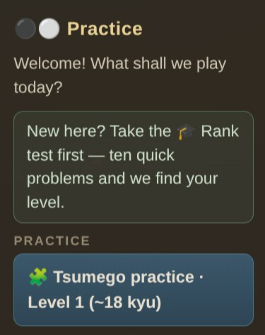

# frank_go

**Learn and enjoy Go (Baduk/Weiqi) — a friendly, offline trainer for
beginners.**





Go is a beautiful game, but the first steps are hard: you can't tell who is
winning, you don't know what to study, and strong software is built for strong
players. frank_go is built for the rest of us.

## What you can do

- 🧩 **Practice tsumego (life & death puzzles)** — 4,700+ problems from the
  classic collections (Cho Chikun's Encyclopedia, Gokyo Shumyo, Xuanxuan Qijing)
  plus 420 commented Go Game Guru problems, served at _your_ level. Solve 5 in a
  row to level up, from level 1 (beginner) to 10 (expert). A **focus** picker
  narrows practice to life & death, tesuji, ko or capturing races.

  

- 🤖 **The puzzles fight back** — if KataGo is installed, it answers your moves
  inside the puzzle. When it gives up the area, frank_go judges the result and
  marks the puzzle **solved automatically**. The commented problems know their
  own answers, so those are graded **exactly**, with the pro's explanation.
- 🎓 **Find your rank** — a ten-problem test estimates your level and drops you
  straight into practice there.
- 🎨 **Area painting** — a toggleable overlay that paints each player's
  influence as a soft gradient and settled territory in solid color, so you can
  _see_ what the stones are doing.
- ⚫ **Play against KataGo** — a one-command setup gives you a beginner-friendly
  opponent (and a full-strength one). A **live score** tells you who's ahead
  (komi included), warns when you're hopelessly behind or the game is settled,
  and move names ("Hane", "One-Point Jump") appear as you hover the board.

  

- 📖 **Study famous games** — from the Ear-Reddening Game (1846) to AlphaGo vs
  Lee Sedol, with the story behind each game (the AlphaGo games include
  move-by-move commentary). Auto-play through them, or switch on **Guess the
  moves** and try to find the pro's next play — with an optional KataGo
  explanation of why your guess fell short.
- 📚 **Browse joseki** — Kogo's Joseki Dictionary, the classic corner-opening
  reference, opens as a commented tree you can walk move by move.
- 🎯 **Quick drills** — _Who is winning?_ (guess the leader of a real position),
  and a **ladder** trainer that generates endless, verified capture-or-escape
  problems.

  

- 🎌 **Hikaru no Go mode** — nearly every game in the manga is a _real_
  professional game, and 15 of them are bundled with their chapter references
  and trivia: read a chapter, then replay the actual kifu here (Sai's internet
  game against Toya Meijin was a real half-point thriller). Character portraits
  are pending —
  [contributions welcome, see issue #6](https://github.com/akitaonrails/frank_go/issues/6);
  meanwhile the app shows go-stone medallions, and you can drop in your own
  images per
  [data/games/hikaru/portraits/FILENAMES.txt](data/games/hikaru/portraits/FILENAMES.txt).
- 🛜 **Fully offline** — no account, no server, your progress stays on your
  machine.

Everything lives in the **practice panel** on the right side: pick an activity,
play, and the controls follow along. New here? It points you at the rank test
first. Menus are trimmed down to the essentials (View → _Show Advanced Menus_
brings the full power-user menus back).



## Install

### Arch Linux (AUR)

```sh
yay -S frank-go
```

No other setup needed: on first use the app downloads a small CPU engine and
neural network with one click — it works on any machine, no GPU required. If
you'd rather use a system engine, install `katago-cpu` and the app will pick it
up. GPU builds (`katago-opencl` / `katago-cuda`) are faster but only help if you
have a working OpenCL/CUDA driver; without one they simply fall back to the CPU
engine.

### Windows

Download the latest `frank-go-vX.Y.Z-win-x64-setup.exe` (installer) or
`-portable.exe` from the
[Releases page](https://github.com/akitaonrails/frank_go/releases). On first use
the app downloads a small CPU KataGo engine automatically — no GPU required.

> The installer is not code-signed, so Windows SmartScreen may warn "Windows
> protected your PC." Click **More info → Run anyway**.

### macOS

Install with [Homebrew](https://brew.sh):

```sh
brew install --cask akitaonrails/tap/frank-go
```

…or download the `frank-go-vX.Y.Z-mac-arm64.dmg` (Apple Silicon) or `-x64.dmg`
(Intel) from the
[Releases page](https://github.com/akitaonrails/frank_go/releases). The macOS
build is signed with a Developer ID and notarized by Apple, so it opens normally
— no Gatekeeper warning.

KataGo has no official macOS binary, so for the play-vs-AI and guess-review
features install it via [Homebrew](https://brew.sh):

```sh
brew install katago
```

The app detects it automatically. Everything else (tsumego, study, drills, area
painting) works without it.

### From source (any platform)

```sh
git clone https://github.com/akitaonrails/frank_go.git
cd frank_go
npm install
npm run bundle
npm start
```

Optional but recommended — set up the local KataGo opponent (downloads the
engine and a small CPU-friendly network, no GPU needed):

```sh
npm run frank:katago            # add --human for a human-like ~5k opponent
```

More game records for studying (90,000+ professional games):

```sh
npm run frank:games
```

## Keyboard shortcuts

| Shortcut           | Action                 |
| ------------------ | ---------------------- |
| `Ctrl/Cmd+Shift+K` | Start tsumego practice |
| `Ctrl/Cmd+Shift+B` | Toggle area painting   |
| `Ctrl/Cmd+P`       | Pass                   |
| `←` / `→`          | Step through moves     |

## Built on Sabaki

`frank_go` is a fork of [Sabaki](https://sabaki.yichuanshen.de/), the excellent
open source Go board and SGF editor by Yichuan Shen — all of Sabaki's editing,
analysis and engine features are still here (enable _Show Advanced Menus_ to
reach them). The original Sabaki README is preserved in
[docs/SABAKI.md](docs/SABAKI.md).

## For developers & the curious

- [Architecture](docs/ARCHITECTURE.md) — how the trainer is built on top of
  Sabaki, module by module.
- [Staying rebaseable on upstream](docs/UPSTREAM-REBASE.md) — the fork strategy
  and the upgrade procedure.
- [Data sources & licensing](data/SOURCES.md) — where every bundled problem and
  game record comes from.
- [Go ecosystem research](docs/research/README.md) — the survey of clients, AI
  engines and SGF resources that shaped this project.
- [AUR packaging](packaging/aur/) — PKGBUILD template published by the release
  workflow.

Tests: `npm test` · Bundle: `npm run bundle` · Data rebuild:
`npm run frank:data`

## License

MIT, same as Sabaki. Bundled problem collections and game records have their own
provenance — see [data/SOURCES.md](data/SOURCES.md).
